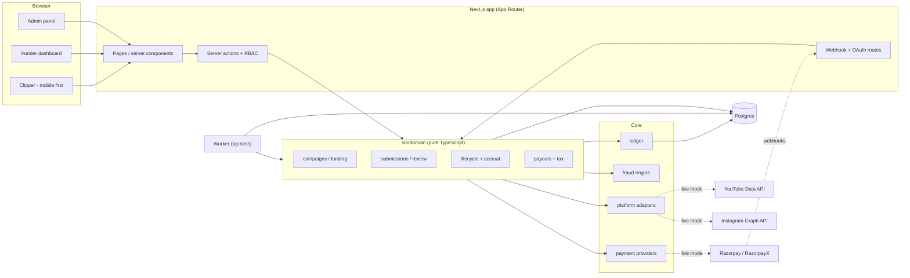
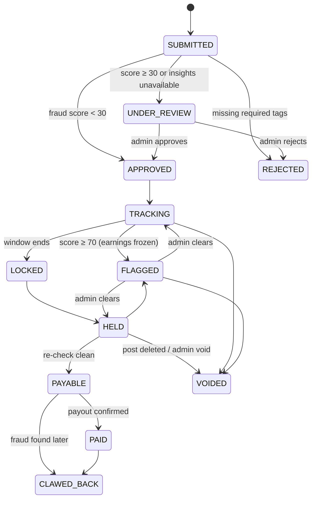

# Architecture

One Next.js app + one worker process + one Postgres. No Redis, no queues outside Postgres, no
microservices.

## Module boundaries

| Module       | Owns                                                                              | Must not                                |
| ------------ | --------------------------------------------------------------------------------- | --------------------------------------- |
| `lib/money`  | paise arithmetic & formatting                                                     | use floats                              |
| `ledger/`    | posting balanced, idempotent transactions; balances; verification                 | know about submissions                  |
| `fraud/`     | pure rules `(FraudContext) => signal                                              | null`, scoring, decisions               | touch the DB |
| `platforms/` | talking to Instagram / YouTube (or the mock)                                      | touch the DB (except the quota tracker) |
| `payments/`  | talking to the payment provider (or the mock)                                     | touch the DB                            |
| `domain/`    | business workflows; the only layer that combines the above inside DB transactions | render UI                               |
| `app/`       | pages, forms, RBAC checks, calling domain functions                               | contain business rules                  |
| `jobs/`      | scheduling domain sweeps                                                          | contain business rules                  |

## Adapter pattern

`PlatformAdapter` (src/platforms/types.ts): `parsePostUrl`, `verifyAccountOwnership`,
`fetchPostMetrics` (batched), `fetchPostExists`, `fetchAccountProfile`. `getAdapter(platform)`
returns the mock unless `YOUTUBE_ADAPTER=live` / `INSTAGRAM_ADAPTER=live`. Adapters receive an
`AccountRef` with a _decrypted_ token instead of the Prisma row, so they never see ciphertext.

`PaymentProvider` (src/payments/types.ts): `createFundingOrder`, `checkoutFor`,
`verifyWebhookSignature`, `parseWebhook` (normalizes provider events), `createPayout` (with an
idempotency key), `getPayoutStatus`. `PAYMENTS_PROVIDER=razorpay` switches to the skeleton.

## Background jobs

All jobs are **sweeps over database state** scheduled with pg-boss cron (policy `stately`, so a
sweep never overlaps itself). Per-submission timers live on the row (`nextSnapshotAt`,
`trackingEndsAt`, `holdEndsAt`), which makes every job idempotent, batchable per platform, and
immune to lost timers.

| Job                   | Cron         | Work                                                                                             |
| --------------------- | ------------ | ------------------------------------------------------------------------------------------------ |
| `metrics-poll`        | every minute | due snapshots (T+0, 1h, 6h, 24h, then daily), batched ≤50/platform call; fraud; accrual          |
| `lifecycle-lock`      | every minute | tracking window ended → final snapshot, lock views (capped), final accrual, LOCK fraud run, HELD |
| `lifecycle-hold-end`  | every 5 min  | re-check post exists / views dropped → HOLD_END fraud run → PAYABLE                              |
| `campaigns-sweep`     | every 5 min  | end campaigns past `endsAt`; settle finished ones (unused budget → refund payable)               |
| `payouts-sync`        | every 2 min  | poll provider for PROCESSING payouts (webhooks can be missed)                                    |
| `notifications-email` | every minute | send in-app notifications through the email adapter                                              |
| `tokens-refresh`      | daily        | refresh Instagram long-lived tokens; disconnect revoked accounts                                 |
| `ledger-verify`       | daily        | integrity check; result on the admin health panel                                                |

Every step runs in one transaction with row locks taken in a fixed order (campaign, then
submission) and re-checks state after locking, so retries and overlapping workers are safe.

## Submission lifecycle

`reviewState` (NONE / NEEDS_REVIEW / CLEARED) is kept separate from `status` so a submission in
manual review keeps tracking views. A cleared submission is only re-flagged if its score rises
above the score it was cleared at.

## Request flow: submitting a post

1. Server action → `requireUser("CLIPPER")` (DB-loaded user, never trusts the client) → device
   fingerprint recorded (hashed).
2. `submitPost`: campaign open? joined? account verified & on an allowed platform? URL parses?
   Duplicate `(platform, platformPostId)` anywhere? (→ `DuplicateAttempt` + error).
3. Adapter fetches T+0 metrics: ownership of the post, Shorts duration, required tags.
4. One transaction: create submission + T+0 snapshot → fraud `SUBMIT` run → approve & accrue,
   review, or reject. The response includes a rule-check list for instant feedback.

## Time travel (development only)

Tracking takes weeks in real time. The MockAdapter's numbers are a pure function of time since
posting, so `domain/devtools.ts` can shift a submission into the past and replay every due step
with a virtual clock — running the same lifecycle code as the worker. The seed, the E2E test and
the admin "Fast-forward" button use it. Disabled when `APP_ENV=production`.
